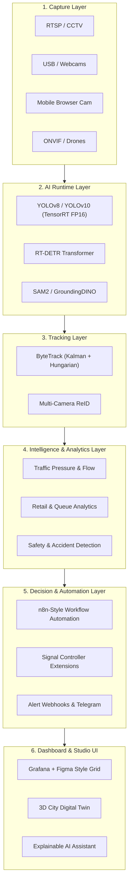

# 🌐 ATOS Studio — Open-Source Visual Intelligence Platform

> **Operating System for Camera Intelligence**  
> **Architecture:** Decoupled Engine-Studio Paradigm (ATOS Engine + ATOS Studio)  
> **License:** Apache-2.0 / MIT (Open-Source)

---

## 🏛️ 1. Two-Product Architectural Division

To achieve commercial-grade performance while maintaining developer agility, ATOS is divided into two decoupled products:

```
┌─────────────────────────────────────────────────────────────────────────────┐
│                             ATOS Studio (Web UI)                            │
│   Next.js 14 | React 18 | TypeScript | TailwindCSS | Three.js | React Flow  │
└──────────────────────────────────────┬──────────────────────────────────────┘
                                       │
                         REST / WebSockets / gRPC Control
                                       │
┌──────────────────────────────────────▼──────────────────────────────────────┐
│                            ATOS Control Plane API                           │
│              FastAPI / Python / Node / Redis Streams / PostgreSQL            │
└──────────────────────────────────────┬──────────────────────────────────────┘
                                       │
                      Zero-Copy Shared Memory / UDP Sockets
                                       │
┌──────────────────────────────────────▼──────────────────────────────────────┐
│                             ATOS Engine (Core C++)                          │
│     C++17/20 | CUDA 12.4 | TensorRT 10 | OpenCV 4.9 | Pinned Memory DMA     │
└─────────────────────────────────────────────────────────────────────────────┘
```

### A. ATOS Engine (C++/CUDA/TensorRT Core)
- **Role**: High-throughput, zero-latency inference and computer vision pipeline.
- **Key Modules**:
  - `VideoCaptureEngine`: Multi-threaded ingestion supporting RTSP, HTTP IP webcams, USB cameras, local video files, and ONVIF devices.
  - `CUDAPreprocessor`: Fused CUDA kernels (`kernel_fusion.cu`) for single-pass resize, BGR→RGB conversion, float normalization, and edge contrast boosting.
  - `TensorRTEngine`: Asynchronous FP16 YOLOv8 / RT-DETR execution via `cudaStream_t` and `nvinfer_10`.
  - `ByteTrackEngine`: High-performance Kalman Filter & Hungarian algorithm multi-object tracker.
  - `ReIDModelAdapter`: Vehicle feature vector extractor & cross-camera identity correlation engine (`include/reid/reid_adapter.hpp`, `tools/reid_engine.py`).
  - `TelemetryServer`: Low-latency UDP/WebSocket state synchronization server.

### B. ATOS Studio (Browser Platform & Dashboard)
- **Role**: Next-gen browser-based visual intelligence operating system.
- **Key Features**:
  - **Live Camera Grid**: Configurable 1, 2, 4, 8, 16, and 32 camera video feeds with real-time HUD overlays.
  - **Mobile Browser Camera**: Instantly converts any smartphone camera into a live AI node with zero app installation.
  - **Automation Builder**: Node-based drag-and-drop workflow editor (React Flow) connecting detections to webhooks, Telegram, email, and digital twin actions.
  - **3D Digital Twin**: Interactive 3D urban traffic representation powered by Three.js & MapLibre GL.
  - **Explainable AI & Assistant**: Real-time traffic pressure breakdown formulas, confidence scores, and natural language query engine.

---

## 🏗️ 2. Comprehensive Layered Architecture



---

## 🚦 3. Multi-Plugin Ecosystem

ATOS Studio features an installable plugin system extending camera intelligence across domains:

| Plugin Domain | Analytics & Detections | Primary Sensors & Action Triggers |
| :--- | :--- | :--- |
| 🚥 **Traffic Intelligence** | Vehicle counting, queue length, lane pressure, speed, signal extension | Adaptive traffic light controllers, UDP telemetry |
| 🏪 **Retail & Commercial** | Foot traffic, heatmaps, queue wait times, dwell time distribution | Customer density alerts, POS system integration |
| 🦺 **Industrial & Safety** | Hard hat & PPE compliance, hazardous zone breaches, smoke/fire | Emergency siren triggers, automated supervisor SMS |
| 🌾 **Agriculture & Wildlife** | Livestock counting, crop growth tracking, animal intruder alerts | Perimeter deterrence, farm automation webhooks |
| 🏢 **Smart Campus & Security** | Wrong-way pedestrian flow, tailgating, license plate OCR | Gate opening relays, security guard alerts |

---

## 🗺️ 4. Multi-Version Platform Roadmap

- **v1.0 (Current Baseline)**: Real-time traffic intelligence engine with C++/CUDA TensorRT acceleration, `VideoCaptureEngine`, `ConfigManager`, and UDP telemetry.
- **v2.0**: Plugin system, FastAPI control plane, WebSocket video gateway, and React Studio dashboard.
- **v3.0**: Multi-camera city graph, cross-camera vehicle Re-ID, and mobile web browser camera node ingestion.
- **v4.0**: Interactive 3D Digital Twin powered by Three.js and MapLibre GL.
- **v5.0**: Predictive AI & congestion forecasting models.
- **v6.0**: Autonomous city-scale traffic & signal grid optimization.
