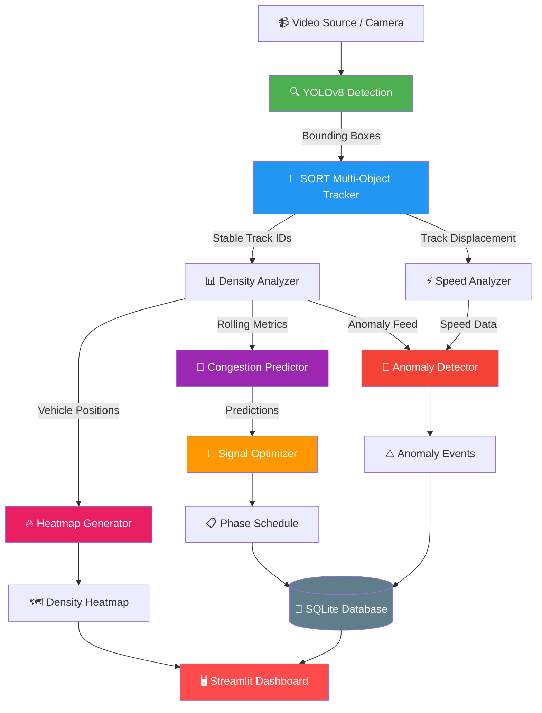

# 🚦 AI-Powered Smart Traffic Intelligence System

[](https://python.org)
[](https://docs.ultralytics.com)
[](LICENSE)
[](test.py)
[](src/dashboard.py)
[](Dockerfile)
[](src/database.py)

**An end-to-end intelligent traffic monitoring and decision-making system** that combines real-time computer vision, multi-object tracking, ML-based congestion prediction, and adaptive signal optimization — with built-in **anomaly detection**, **vehicle speed estimation**, **spatial density heatmaps**, and a **persistent analytics database**.

> 🎯 **What makes this different?** Unlike typical traffic-counting demos, this system implements a complete intelligence pipeline: it doesn't just *count* vehicles — it *predicts* congestion, *optimizes* signal timing, *detects* anomalies (accidents, sudden drops), *estimates* speeds, and *persists* all data for historical analysis.

---

## 🏗️ System Architecture



---

## ✨ Key Features

| Module | Capability | Tech |
|--------|-----------|------|
| 🔍 **Detection** | Real-time vehicle detection with per-class counting (car, bus, truck, motorcycle) | YOLOv8 + OpenCV |
| 🎯 **Tracking** | Stable vehicle IDs across frames using Kalman Filters + Hungarian Assignment | Custom SORT |
| 📊 **Density Analysis** | Lane-aware occupancy, EMA smoothing, flow rate, congestion scoring (0-100) | NumPy + Polygon ROI |
| 🧠 **Prediction** | ML congestion forecasting with Platt-calibrated probabilities | Gradient Boosting + scikit-learn |
| 🚦 **Signal Optimization** | Pressure-weighted green-time allocation with safety clamps | Custom Engine |
| 🚨 **Anomaly Detection** | Z-score spikes, sudden drops, congestion surges, trend reversals | Statistical Methods |
| ⚡ **Speed Analytics** | Per-vehicle speed estimation, direction classification, violation detection | Kalman Displacement |
| 🔥 **Heatmaps** | Gaussian-kernel spatial density visualization with temporal decay | OpenCV Colormap |
| 💾 **Database** | Persistent SQLite storage with CSV/JSON export for historical analysis | SQLite3 + WAL mode |
| 📷 **Multi-Camera** | Parallel pipeline management with comparative cross-junction analytics | Threaded Manager |

---

## 🚀 Quick Start

### 1. Install

```bash
# Clone the repository
git clone https://github.com/Karthik2509/AI-Traffic-Intelligence-System.git
cd AI-Traffic-Intelligence-System

# Create virtual environment and install dependencies
python -m venv venv
source venv/bin/activate      # Windows: venv\Scripts\activate
pip install -r requirements.txt
```

### 2. Run the Dashboard

```bash
streamlit run src/dashboard.py
```

### 3. Run Detection on a Static Image

```bash
python -m src.detection
# Input: data/test.jpg → Output: output/output.jpg
```

### 4. Run the Full Pipeline Programmatically

```python
from src.pipeline import pipeline_from_config

# Load settings from config/settings.yaml automatically
pipeline = pipeline_from_config(source="data/your_video.mp4")

for result in pipeline.run():
    print(f"Frame {result.frame_idx}: {result.metrics['total_vehicles']} vehicles")
    print(f"  Congestion: {result.metrics['congestion_score']:.1f}/100")
    print(f"  Trend: {result.metrics['trend']}")
```

### 5. Run Tests

```bash
pytest test.py -v --tb=short          # 85 tests
pytest test.py -v --cov=src           # with coverage
```

---

## 🔥 Unique Capabilities

### 🚨 Traffic Anomaly Detection

The system includes a **real-time anomaly detection engine** that monitors traffic patterns and fires structured alerts:

- **Z-Score Spike Detection** — Flags when vehicle count deviates >2.5σ from the rolling mean
- **Sudden Flow Drop** — Detects >50% flow rate drops indicating potential accidents
- **Congestion Surge** — Alerts when congestion score exceeds critical threshold persistently
- **Trend Reversal** — Detects rapid shifts from declining to rising traffic (upstream wave)
- **Speed Anomaly** — Flags sudden drops in average vehicle speed

Each event includes severity classification, confidence score, and a frozen metrics snapshot.

### ⚡ Vehicle Speed Estimation

Using Kalman filter track displacement data:

```
Speed = (pixel_displacement / pixels_per_meter) × FPS × 3.6 km/h
```

- Configurable camera calibration factor (`pixels_per_meter`)
- EMA-smoothed to reduce single-frame noise
- **5 speed classes**: stopped, slow, normal, fast, speeding
- Automatic violation detection based on configurable speed limits

### 🔥 Spatial Density Heatmaps

Gaussian-kernel smoothed heatmaps showing traffic concentration hotspots:

- Accumulates vehicle center points with temporal decay
- Applies `GaussianBlur` → `applyColorMap(JET)` for visualization
- Alpha-blendable overlay on original frames
- Exportable as standalone images for reports

### 💾 Persistent Analytics (SQLite)

All metrics are persisted to a structured SQLite database:

- **Frame metrics**: vehicle counts, density, congestion scores, flow rates
- **Signal logs**: every signal optimization recommendation
- **Anomaly events**: all detected incidents with metadata
- **Speed records**: per-vehicle speed measurements
- **Export**: CSV and JSON batch export for data science workflows

---

## ⚙️ Configuration

All parameters are controlled via `config/settings.yaml`:

| Section | Key | Default | Description |
|---------|-----|---------|-------------|
| `model` | `name` | `yolov8n.pt` | YOLO model variant |
| `detection` | `confidence_threshold` | `0.40` | Minimum box confidence |
| `detection` | `frame_skip` | `1` | Process every N-th frame |
| `density_thresholds` | `low` / `high` | `10` / `25` | Count thresholds for labels |
| `signal` | `cycle_time_s` | `120` | Total signal cycle (seconds) |
| `anomaly` | `zscore_threshold` | `2.5` | Std-devs for spike detection |
| `speed` | `pixels_per_meter` | `8.0` | Camera calibration factor |
| `heatmap` | `decay_factor` | `0.96` | Temporal decay rate |
| `database` | `path` | `output/traffic.db` | SQLite database file |

---

## 📁 Project Structure

```
AI-Traffic-Intelligence-System/
├── config/
│   └── settings.yaml            # All tunable parameters
├── data/
│   └── test.jpg                 # Default test image
├── output/                      # Annotated frames, logs, database
├── scripts/
│   └── generate_synthetic_video.py  # Test data generator
├── src/
│   ├── __init__.py              # Public API exports
│   ├── detection.py             # YOLOv8 inference + annotation
│   ├── tracker.py               # SORT multi-object tracker (Kalman + Hungarian)
│   ├── density_analyzer.py      # Lane-aware density + flow analysis
│   ├── predictor.py             # ML congestion classifier (GBM + Platt)
│   ├── signal_optimizer.py      # Dynamic signal timing engine
│   ├── anomaly_detector.py      # Statistical anomaly detection 🆕
│   ├── speed_analyzer.py        # Vehicle speed estimation 🆕
│   ├── heatmap.py               # Spatial density heatmaps 🆕
│   ├── database.py              # SQLite persistence layer 🆕
│   ├── multi_camera.py          # Multi-camera feed management
│   ├── pipeline.py              # End-to-end video orchestrator
│   ├── dashboard.py             # Streamlit dashboard
│   └── utils.py                 # Logging, config, buffers
├── .github/
│   └── workflows/ci.yml         # GitHub Actions CI
├── test.py                      # 85 unit + integration tests
├── Dockerfile                   # Container deployment
├── pyproject.toml               # Package metadata
├── requirements.txt             # Dependencies
└── LICENSE                      # MIT License
```

---

## 🐳 Docker Deployment

```bash
docker build -t traffic-ai .
docker run -p 8501:8501 traffic-ai
```

Access the dashboard at `http://localhost:8501`.

---

## 🧪 Testing

The project includes **85 automated tests** covering all modules:

```bash
# Run all tests
pytest test.py -v --tb=short

# Run with coverage
pytest test.py --cov=src --cov-report=term-missing

# Run specific module tests
pytest test.py -k "TestDatabase" -v        # Database persistence
pytest test.py -k "TestAnomalyDetector" -v # Anomaly detection
pytest test.py -k "TestSpeedAnalyzer" -v   # Speed analytics
pytest test.py -k "TestHeatmap" -v         # Heatmap generation
```

---

## 🛠️ Tech Stack

| Component | Technology |
|-----------|-----------|
| Object Detection | YOLOv8 (Ultralytics) |
| Video I/O | OpenCV (cv2) |
| Multi-Object Tracking | Custom SORT (Kalman + Hungarian, SciPy) |
| Density Analysis | Custom EMA + Polygon Occupancy |
| Congestion Prediction | Gradient Boosting + Platt Calibration (scikit-learn) |
| Signal Optimization | Pressure-Weighted Proportional Allocation |
| Anomaly Detection | Z-Score + Statistical Methods |
| Speed Analytics | Kalman Filter Displacement + EMA |
| Heatmaps | Gaussian Kernel Density (OpenCV) |
| Data Persistence | SQLite3 (WAL mode) |
| Dashboard | Streamlit + Altair |
| Configuration | PyYAML |
| Testing | pytest + pytest-cov |
| Containerization | Docker (multi-stage build) |
| CI/CD | GitHub Actions |

---

## 🤝 Contributing

See [CONTRIBUTING.md](CONTRIBUTING.md) for guidelines on:
- Code style (Black, isort)
- Pull request workflow
- How to add a new detector or optimizer module

---

## 📄 License

This project is licensed under the [MIT License](LICENSE).