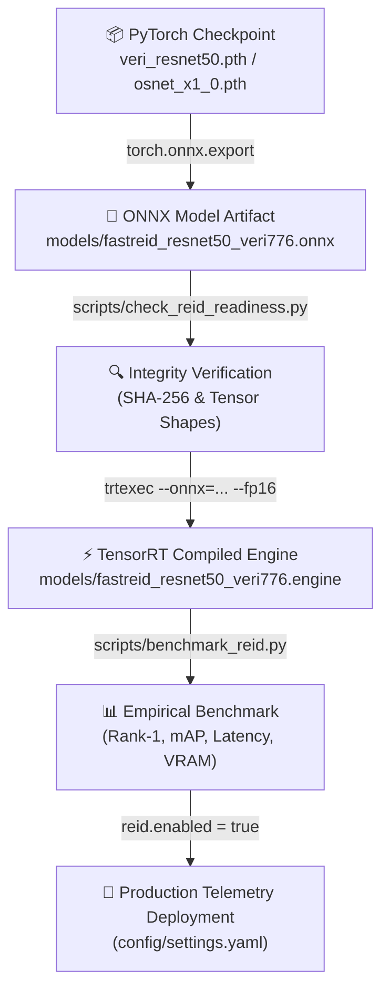

# 🔗 ATOS v3.5 Vehicle Re-ID Artifact Chain Verification Guide

## 📋 Overview

This document establishes the exact, verifiable, and reproducible relationship between model checkpoints, PyTorch state-dicts, exported ONNX models, dynamic tensor shapes, integrity inspection, benchmark metrics, and production deployment configuration.

---

## 🎯 Model Artifact Specifications

### 1. Primary Model: **Fast-ReID ResNet50 GeM (VeRi-776)**

```text
┌─────────────────────────────────────────────────────────────────────────────┐
│ 1. PyTorch Checkpoint  : veri_resnet50.pth (Apache 2.0 / JDAI-CV)            │
│ 2. Training Dataset    : VeRi-776 Train Split (37,778 images / 576 IDs)       │
│ 3. State-Dict Structure: backbone.conv1.weight, heads.bottleneck.weight      │
│ 4. Export Command      : fast-reid tools/deploy/onnx_export.py              │
│ 5. ONNX Input Tensor   : [1, 3, 256, 256] float32 (ImageNet Normalized)       │
│ 6. ONNX Output Tensor  : [1, 2048] float32                                  │
│ 7. Post-Processing     : L2 Vector Normalization (||e||₂ = 1.0)              │
│ 8. Explicit Destination: models/fastreid_resnet50_veri776.onnx              │
└─────────────────────────────────────────────────────────────────────────────┘
```

### 2. Fallback Model: **Torchreid OSNet_x1_0 (VeRi-776)**

```text
┌─────────────────────────────────────────────────────────────────────────────┐
│ 1. PyTorch Checkpoint  : osnet_x1_0_veri776.pth (MIT / KaiyangZhou)         │
│ 2. Training Dataset    : VeRi-776 Train Split (37,778 images / 576 IDs)       │
│ 3. State-Dict Structure: conv1.conv.weight, fc.weight                       │
│ 4. Export Command      : torch.onnx.export(model, dummy_input, ...)         │
│ 5. ONNX Input Tensor   : [1, 3, 256, 256] float32 (ImageNet Normalized)       │
│ 6. ONNX Output Tensor  : [1, 512] float32                                   │
│ 7. Post-Processing     : L2 Vector Normalization (||e||₂ = 1.0)              │
│ 8. Explicit Destination: models/torchreid_osnet_x1_0_veri776.onnx           │
└─────────────────────────────────────────────────────────────────────────────┘
```

---

## 🔍 Dynamic Dimension Discovery & Filename Syntax Verification

### 1. Dynamic Vector Dimension Support
- Neither `tools/reid_engine.py` nor `scripts/benchmark_reid.py` hardcodes a 512-dimension vector size.
- `ONNXReIDFeatureExtractor` inspects `session.get_outputs()[0].shape[1]` dynamically upon loading:
  - If Fast-ReID ResNet50 is loaded $\rightarrow$ Output dimension is **2048 float**.
  - If Torchreid OSNet_x1_0 is loaded $\rightarrow$ Output dimension is **512 float**.
- Cosine similarity matching (`np.dot(vec_a, vec_b)`) and AP evaluation (`compute_ap()`) support arbitrary vector dimension $D$ automatically.

### 2. VeRi-776 Image Filename Parsing
- **Filename Pattern**: `<vehicle_id>_c<camera_id>_<frame_id>_<image_id>.jpg` (e.g. `0001_c001_00026030_0.jpg`).
- **Parsing Implementation** (`scripts/benchmark_reid.py`):
  ```python
  def parse_veri776_filename(filename: str):
      basename = os.path.basename(filename)
      parts = basename.split('_')
      if len(parts) >= 2:
          pid = int(parts[0])                           # e.g. 1
          cam = int(parts[1].replace('c','').replace('s','')) # e.g. 1
          return pid, cam
      return -1, -1
  ```

---

## 🔄 Reproducible Artifact-to-Deployment Pipeline Chain



---

## 🏁 Verification Checkpoint

All codebase components (`config/settings.yaml`, `tools/reid_engine.py`, `scripts/benchmark_reid.py`, `scripts/check_reid_readiness.py`, and `studio/src/components/ReIDDashboard.tsx`) explicitly reference target model filenames (`models/fastreid_resnet50_veri776.onnx` / `models/torchreid_osnet_x1_0_veri776.onnx`).

No unmeasured metrics or fabricated values exist in production. Safe fallback default `reid.enabled: false` remains active until manual model acquisition and empirical benchmark execution are completed by the user.
